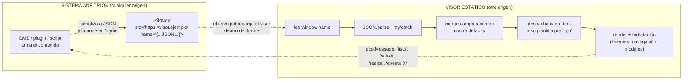

# Patrón "Visor parametrizable por iframe"

Guía **general y reutilizable** de la tecnología que hay detrás de este visor.
No describe *este* visor en particular, sino el patrón que lo hace posible: un
front-end estático, sin build, cuyo contenido lo define íntegramente el sistema
que lo incrusta. Sirve para construir cualquier "cosa embebible y editable":
visores de unidad, fichas de producto, reportes, tableros, catálogos, pantallas
de kiosco, widgets de un CMS, etc.

La idea en una frase:

> El visor es una **función pura de su entrada**. No tiene base de datos, no tiene
> backend, no tiene panel de administración. Alguien (un CMS, un plugin, una
> página PHP, otro front-end) le pasa un JSON al cargarlo dentro de un `<iframe>`,
> y el visor lo dibuja. Editar el contenido = cambiar ese JSON en el host.

---

## Índice

1. [Qué problema resuelve](#1-qué-problema-resuelve)
2. [Arquitectura de un vistazo](#2-arquitectura-de-un-vistazo)
3. [Los 6 pilares](#3-los-6-pilares)
4. [Mecanismo central: pasar datos por `window.name`](#4-mecanismo-central-pasar-datos-por-windowname)
5. [Diseñar el contrato de datos (tu esquema JSON)](#5-diseñar-el-contrato-de-datos-tu-esquema-json)
6. [El pipeline de render](#6-el-pipeline-de-render)
7. [Despacho por plantillas y el "tipo de escape"](#7-despacho-por-plantillas-y-el-tipo-de-escape)
8. [Modelo de confianza y seguridad](#8-modelo-de-confianza-y-seguridad)
9. [Puente bidireccional con el contenedor](#9-puente-bidireccional-con-el-contenedor)
10. [Utilidades transversales](#10-utilidades-transversales)
11. [Esqueleto mínimo para replicarlo](#11-esqueleto-mínimo-para-replicarlo)
12. [Checklist de implementación](#12-checklist-de-implementación)
13. [Cuándo NO usar este patrón](#13-cuándo-no-usar-este-patrón)

---

## 1. Qué problema resuelve

**Situación típica:** tenés un sistema anfitrión (Moodle, WordPress, un ERP, un
intranet propio) que sabe *qué* contenido mostrar, pero cuya UI nativa es fea,
rígida o difícil de tocar. Querés una presentación bonita, moderna y consistente
para ese contenido, sin:

- montar otro servidor/base de datos,
- pedirle al equipo del anfitrión que cambie su plantilla,
- acoplar el diseño al ciclo de deploy del anfitrión,
- resolver CORS, autenticación cruzada, sesiones compartidas.

**La solución:** un visor 100% estático (HTML + CSS + JS) publicado en cualquier
hosting tonto (GitHub Pages, S3, Netlify, un directorio en el mismo servidor). El
anfitrión lo incrusta en un `<iframe>` y le "inyecta" el contenido ya resuelto,
como JSON, en el momento de la carga. El visor no sabe ni le importa quién es el
anfitrión ni en qué dominio corre.

**Ventajas:**

| | |
|---|---|
| **Cero infraestructura** | Son archivos estáticos. Se sirven desde cualquier lado, cachean perfecto, no se caen. |
| **Desacople total** | El visor se versiona, se testea y se despliega solo. El anfitrión solo necesita saber la URL y el formato del JSON. |
| **Sin CORS ni backend** | `window.name` cruza orígenes sin configurar nada (ver §4). |
| **Editable donde ya se edita** | El contenido se arma en el anfitrión (formulario del plugin, editor del CMS, script). No hay un segundo lugar donde administrar cosas. |
| **Portable** | El mismo visor sirve a varios anfitriones distintos a la vez, cada uno pasándole su propio JSON. |

**Costo/limitaciones:** no hay estado persistente propio, no hay usuarios, no hay
escritura (es de solo lectura), y el tamaño del payload tiene un límite práctico
(varios MB, más que suficiente para contenido, no para adjuntos binarios). Ver §13.

---

## 2. Arquitectura de un vistazo



Flujo mínimo:

1. El anfitrión **serializa** los datos (`JSON.stringify` / `json_encode`).
2. Los mete en el atributo `name` del `<iframe>` (o en `iframe.contentWindow.name`).
3. El navegador carga el visor dentro del frame.
4. El visor lee `window.name`, lo parsea, lo valida campo a campo y lo dibuja.
5. (Opcional) El visor y el anfitrión se hablan por `postMessage` para acciones
   que necesitan al anfitrión (cerrar un panel, ajustar el alto, avisar un click).

---

## 3. Los 6 pilares

### Pilar 1 — Visor estático, sin build, sin framework

HTML + CSS + JS plano. Como mucho, una librería de iconos por CDN. Sin webpack,
sin `node_modules`, sin transpilación. Se abre con doble clic o `Live Server`
para desarrollar, y se sube tal cual a producción.

*Por qué:* elimina toda una categoría de problemas (pipeline de build, versiones
de dependencias, tamaño de bundle, CVEs de terceros) y hace que el visor sea
trivial de auditar, hospedar y mantener por años.

### Pilar 2 — Los datos entran por `window.name`

El canal de comunicación anfitrión → visor es la propiedad `window.name` del
frame, que el anfitrión rellena con un string JSON. Ver §4 en detalle (es la
pieza menos obvia y la más importante).

### Pilar 3 — Contrato de datos tipado, con defaults por tipo

Se define un esquema JSON explícito: un objeto raíz con metadatos + un array de
"ítems", donde cada ítem declara su `tipo`. Cada tipo tiene su propio conjunto de
campos y sus propios valores por defecto. Ver §5.

### Pilar 4 — Cero contenido hardcodeado + tolerancia a datos parciales

Ningún texto real vive en el código. Todo campo ausente, vacío o corrupto se
completa con un placeholder genérico y evidente — **campo por campo**, nunca
descartando el objeto entero. El visor **jamás** muestra una página en blanco ni
un error de JS al usuario final. Ver §6.

### Pilar 5 — Despacho por plantillas + un "tipo de escape"

Un registro `tipo → función de render`. Agregar una variante de contenido = sumar
una entrada al registro. Además, un tipo especial (`personalizado` / `custom` /
`raw`) que inyecta HTML o un iframe anidado tal cual, para todo lo que no encaje
en los tipos previstos, sin tocar el código del visor. Ver §7.

### Pilar 6 — Puente por `postMessage` con fallback garantizado

Cuando el visor necesita algo del anfitrión (volver a una vista, ajustar tamaño,
notificar interacción), lo pide por `postMessage` y espera confirmación con
**timeout**. Si el anfitrión no contesta (o no hay anfitrión), cae a un
comportamiento por defecto que siempre funciona. Ver §9.

---

## 4. Mecanismo central: pasar datos por `window.name`

### 4.1 Por qué `window.name` y no otra cosa

| Alternativa | Problema |
|---|---|
| **Query string** (`?data=...`) | Límite práctico de ~2000 caracteres en URLs (error `414 URI Too Long` en muchos servidores/proxies). Un payload de contenido real lo revienta enseguida. |
| **`postMessage` al cargar** | Requiere un *handshake*: el visor tiene que cargar, registrar su listener y avisar "estoy listo" **antes** de que el anfitrión mande los datos. Condición de carrera si el mensaje llega primero. Protocolo extra. |
| **`fetch` a una API** | Vuelve a meter un backend, CORS, autenticación, y un punto de falla de red. |
| **`localStorage` / `sessionStorage`** | No cruza orígenes. El anfitrión (un origen) no puede escribir el storage del visor (otro origen). |
| **`window.name`** | Sin límite práctico (varios MB). Disponible **desde la primera línea** del script del visor, sin esperar nada. Cruza orígenes sin configurar CORS. |

### 4.2 Por qué funciona entre orígenes distintos

`window.name` es una propiedad especial:

- **Persiste a través de navegaciones** dentro del mismo frame/pestaña, incluso
  si cambia el origen.
- El atributo HTML `name` de un `<iframe>` se convierte automáticamente en el
  `window.name` del documento que carga adentro.
- **No es el padre leyendo el `name` del hijo** (eso sí lo bloquea la
  same-origin policy). Es el **propio visor**, ya cargado en su frame, leyendo
  el `window.name` de **su propia ventana** — algo que un documento siempre
  puede hacer sobre sí mismo.

Por eso un anfitrión en `moodle.universidad.edu` puede pasarle datos a un visor
en `usuario.github.io` sin que ninguno de los dos toque configuración de CORS.

### 4.3 Las dos formas de fijarlo (elegí UNA)

**Forma A — atributo HTML estático (recomendada).** El anfitrión imprime el
`<iframe>` con `name` y `src` en la misma etiqueta:

```php
<?php
// El anfitrión (aquí PHP, podría ser cualquier lenguaje) arma el objeto:
$datos = [
  'titulo' => 'Mi contenido',
  'items'  => [ /* ... */ ],
];
?>
<iframe
  title="Visor"
  style="width:100%; height:100vh; border:0; display:block;"
  src="https://usuario.github.io/mi-visor/"
  name='<?php echo htmlspecialchars(json_encode($datos), ENT_QUOTES); ?>'>
</iframe>
```

- `json_encode(...)` produce el JSON.
- `htmlspecialchars(..., ENT_QUOTES)` escapa `"`, `'`, `<`, `>`, `&` **para que
  el JSON quepa dentro del valor de un atributo HTML** sin romper el parseo del
  `<iframe>`. Es escapado de *atributo HTML*, no de JSON. El navegador decodifica
  el atributo y `window.name` recibe el JSON limpio, listo para `JSON.parse()`.

**Forma B — desde JavaScript (si el anfitrión crea/mueve el iframe dinámicamente).**

```js
const iframe = document.createElement('iframe');
// CLAVE: fijar contentWindow.name, NO iframe.name, y ANTES de src.
iframe.src = 'about:blank';
document.body.appendChild(iframe);
iframe.contentWindow.name = JSON.stringify(datos);
iframe.src = 'https://usuario.github.io/mi-visor/';
```

- Usá `iframe.contentWindow.name` — `iframe.name` solo refleja el atributo del
  tag, no el `window.name` real del documento de adentro.
- Fijalo **antes** de asignar la `src` definitiva: algunas navegaciones resetean
  `window.name` si se fija después.

### 4.4 Cómo lo lee el visor

```js
function leerEntrada() {
  try {
    if (!window.name) return null;                 // abierto suelto, sin anfitrión
    const data = JSON.parse(window.name);
    if (!data || typeof data !== 'object') return null;
    return data;
  } catch (e) {
    return null;                                    // JSON corrupto → no rompe nada
  }
}
```

`null` en cualquiera de los dos casos (vacío o corrupto). De ahí en más el visor
trata ese `null` como `{}` y el pipeline de defaults (§6) hace que la página se
vea bien igual, con placeholders.

### 4.5 Seguridad de `window.name` — importante

`window.name` **no es un canal secreto**. Cualquier script que corra después en
ese frame (incluidos embeds de terceros que el visor cargue más tarde) puede
leerlo, y se comparte con cualquier página a la que el frame navegue después.

- **No pases** tokens de sesión, credenciales, datos personales sensibles ni
  nada que no quieras que quede expuesto.
- Pasá **contenido para mostrar** y, como mucho, identificadores no sensibles
  (un id de sección, una URL de retorno).
- Si el visor necesita datos protegidos, esos tienen que venir por un canal
  autenticado aparte (y ahí ya no aplica del todo este patrón — ver §13).

---

## 5. Diseñar el contrato de datos (tu esquema JSON)

El contrato es la única superficie de acoplamiento entre anfitrión y visor.
Diseñalo con cuidado y documentalo. Estructura recomendada:

```jsonc
{
  // --- Metadatos del "documento" (todos opcionales salvo, quizás, uno) ---
  "titulo": "Título principal",
  "subtitulo": "",
  "descripcion": "",
  "volver_url": "",              // para el puente con el anfitrión (§9)

  // --- El contenido: un array de ítems tipados ---
  "items": [
    {
      "id": "intro",             // estable, para deep-links y anclas
      "tipo": "texto",           // discrimina la plantilla
      "visible": true,           // opcional, default true
      "orden": 0,                // opcional, default = posición en el array
      // ...campos propios de "texto"...
    },
    {
      "id": "galeria",
      "tipo": "media-grid",
      // ...campos propios de "media-grid"...
    }
  ]
}
```

### 5.1 Reglas de diseño del contrato

1. **Un campo, un default independiente.** Nunca "si falta X, tampoco uso Y".
   Cada campo se resuelve solo contra su propio placeholder.

2. **`tipo` es obligatorio y cerrado.** Una lista blanca de valores. Un `tipo`
   desconocido → el ítem se **descarta en silencio** (no rompe el resto, no deja
   un hueco).

3. **`visible` y `orden` en todos los ítems.** Permiten al anfitrión
   ocultar/reordenar sin reescribir el array. `visible:false` = como si el ítem
   no existiera (ni se renderiza, ni cuenta en resúmenes, ni aparece en la
   navegación). El orden final se recalcula siempre a partir de `orden`, no del
   orden crudo del array — y todo lo derivado (numeración, "X de Y", índice de
   navegación) usa ese orden final.

4. **`id` explícito y estable.** Autogenerá uno (`item-3`) si falta, pero avisá
   en la doc que para enlazar desde afuera hay que poner uno propio (el
   autogenerado cambia si se reordena el array).

5. **Defaults por tipo en una tabla.** Para cada tipo, documentá: qué campos
   acepta, qué default toma cada uno si falta, y qué se ve en ese caso.

6. **Estados vacíos previstos.** Un ítem `media-grid` sin medios no es un error:
   muestra "todavía no hay contenido" en el lugar del contenido. Nunca una
   sección rota.

7. **Distinguí "para embeber" de "para enlazar".** Si un campo es una URL,
   definí explícitamente si el visor la va a incrustar (`<iframe>`), abrir en
   pestaña nueva, o normalizar (§10.1). No lo dejes ambiguo.

8. **Ignorá claves desconocidas en silencio.** Que el anfitrión pueda mandar
   campos de más (para futuras versiones) sin romper nada.

### 5.2 Ejemplo de tabla de tipo (formato recomendado para tu doc)

> ### `media-grid` — grilla de tarjetas de medios
>
> ```jsonc
> { "tipo": "media-grid", "titulo": "Galería",
>   "items": [ { "titulo": "", "url": "", "portada": "" } ] }
> ```
>
> | Campo | Tipo | Default si falta | Notas |
> |---|---|---|---|
> | `titulo` | string | `"Medios"` | `<h2>` de la sección |
> | `items` | array | `[]` → "Todavía no hay medios." | Con 1 ítem, grilla de una columna |
> | `items[].url` | string | `""` | Pasa por `toEmbedUrl()` al abrir |
> | `items[].portada` | string (URL img) | `""` → degradado de relleno | Fondo de la miniatura |

---

## 6. El pipeline de render

Siempre el mismo, sea cual sea el contenido:

```
window.name
   │  leerEntrada() → objeto | null
   ▼
tratar null como {}
   │
   ▼
merge del OBJETO RAÍZ, campo a campo, contra SIN_DATOS
   │   { titulo: recibido.titulo || SIN_DATOS.titulo, ... }
   ▼
para cada item de items[]:
   │   ├─ ¿'tipo' en la lista blanca?  no → descartar (return null)
   │   ├─ merge contra DEFAULTS_POR_TIPO[tipo], campo a campo
   │   └─ normalizar (ej.: 'video' → 'media-grid' con un solo ítem)
   ▼
filtrar por visible === true
   │
   ▼
ordenar por 'orden' (estable: desempata por posición original)
   │
   ▼
para cada item: RENDERERS[item.tipo](item) → string HTML
   │
   ▼
inyectar en el DOM (una sola vez, insertAdjacentHTML)
   │
   ▼
HIDRATACIÓN: recorrer el DOM ya montado y enganchar listeners
   (acordeones, botones, modales, navegación, gestos táctiles)
```

Código del merge (el corazón de la tolerancia a fallos):

```js
const SIN_DATOS = {
  titulo: 'Título del contenido',
  subtitulo: '',
  descripcion: 'Aquí va la descripción.',
  volver_url: '',
  items: [],
};

const DEFAULTS_POR_TIPO = {
  texto:      { titulo: 'Texto', parrafos: [] },
  'media-grid': { titulo: 'Medios', items: [] },
  documento:  { titulo: 'Documento', url: '' },
  personalizado: { titulo: 'Sección', html: '', iframe: '' },
};

function mergeItem(raw, idx) {
  const r = (raw && typeof raw === 'object') ? raw : {};
  const tipo = TIPOS_VALIDOS.includes(r.tipo) ? r.tipo : null;
  if (!tipo) return null;                         // descarte silencioso

  const def = DEFAULTS_POR_TIPO[tipo];
  const base = {
    id: (r.id && String(r.id)) || `item-${idx + 1}`,
    tipo,
    titulo: r.titulo || def.titulo,
    visible: r.visible !== false,                 // default true
    orden: Number.isFinite(r.orden) ? r.orden : idx,
  };

  // Campos propios del tipo, cada uno contra su default:
  let cuerpo = {};
  if (tipo === 'texto') {
    cuerpo = {
      parrafos: Array.isArray(r.parrafos) ? r.parrafos.filter(Boolean) : def.parrafos,
    };
  } else if (tipo === 'media-grid') {
    cuerpo = {
      items: Array.isArray(r.items) ? r.items.map(it => ({
        titulo: (it && it.titulo) || '',
        url: (it && it.url) || '',
        portada: (it && it.portada) || '',
      })) : def.items,
    };
  } // etc.

  return Object.assign(base, cuerpo);
}

function obtenerDatos() {
  const recibido = leerEntrada() || {};
  return {
    titulo: recibido.titulo || SIN_DATOS.titulo,
    subtitulo: recibido.subtitulo || SIN_DATOS.subtitulo,
    descripcion: recibido.descripcion || SIN_DATOS.descripcion,
    volver_url: recibido.volver_url || SIN_DATOS.volver_url,
    items: (Array.isArray(recibido.items) ? recibido.items : SIN_DATOS.items)
      .map(mergeItem)
      .filter(Boolean)
      .filter(it => it.visible)
      .sort((a, b) => a.orden - b.orden),
  };
}
```

### 6.1 Separar render de hidratación

- **Render:** genera *strings* de HTML y los inyecta de una sola vez
  (`insertAdjacentHTML`). Rápido, sin reflows intermedios.
- **Hidratación:** después, recorre el DOM ya montado (`querySelectorAll`) y
  engancha listeners. Los elementos llevan `data-*` para reconectarse con su dato
  (`data-item="3"`, `data-resource="galeria"`).

*Por qué separado:* el HTML como string es fácil de componer y testear; los
listeners se enganchan una sola vez sobre el árbol final; y si mañana querés
mover el render a un `<template>` o a otra técnica, la hidratación no cambia.

### 6.2 Placeholders: genéricos y evidentes

El placeholder tiene que **gritar** que es de relleno ("Título del contenido",
"Aquí va la descripción"). Nunca inventes contenido plausible que se pueda
confundir con un dato real. El objetivo es que, viendo la página, sea obvio qué
llegó de verdad y qué falta.

---

## 7. Despacho por plantillas y el "tipo de escape"

### 7.1 El registro

```js
const RENDERERS = {
  texto:         renderTexto,
  'media-grid':  renderMediaGrid,
  documento:     renderDocumento,
  enlaces:       renderEnlaces,
  personalizado: renderPersonalizado,
};

// En el pipeline:
const html = items.map(it => RENDERERS[it.tipo](it)).join('');
```

Agregar un tipo nuevo = escribir `renderX(item)` y sumar una línea al registro.
El resto del visor (navegación, numeración, resúmenes, temas) no se toca.

### 7.2 El tipo de escape (`personalizado`)

Un tipo cuyo único trabajo es inyectar contenido arbitrario **de confianza**:

```js
function renderPersonalizado(item) {
  if (item.iframe) {
    // URL ya lista para embeber (no se normaliza): el anfitrión sabe lo que manda
    return `<div class="marco"><iframe src="${item.iframe}" loading="lazy"
             title="${item.titulo}" allow="fullscreen"></iframe></div>`;
  }
  if (item.html) {
    // HTML de confianza, inyectado tal cual, EN EL FLUJO de la página
    return `<div class="contenido-libre">${item.html}</div>`;
  }
  return `<p class="vacio">Esta sección todavía no tiene contenido.</p>`;
}
```

*Por qué es importante:* es la válvula de escape que evita que cada caso raro
("un mensaje especial del director", "esta tabla que ya está maquetada en el
CMS", "un embed de un tercero") obligue a tocar y redeployar el visor. El tipo
custom participa de todo lo demás (navegación, orden, numeración, tema visual)
como cualquier otro tipo.

Regla de precedencia clara: si llegan `iframe` y `html`, uno gana (elegí y
documentá cuál). Mismo criterio en todos lados.

---

## 8. Modelo de confianza y seguridad

Este patrón inyecta HTML que viene "de afuera". Definí explícitamente de quién
te fiás:

### 8.1 El contenido lo arma un administrador, no un usuario final

En el caso típico (un plugin de CMS, un formulario de administración, un script
de migración), quien arma el JSON es alguien con permisos de edición del
anfitrión — el mismo nivel de confianza que quien ya podía pegar HTML en el CMS.
Bajo ese supuesto:

- El HTML de campos "ricos" (`html`, `descripcion_html`, etc.) se inyecta **tal
  cual**, sin sanitizar. Es contenido de autoría, no input hostil.
- Solo se escapan los campos declarados **explícitamente como texto plano**:

```js
function escapeHtml(str) {
  return String(str)
    .replace(/&/g, '&amp;').replace(/</g, '&lt;').replace(/>/g, '&gt;');
}
// Uso: un campo "descripcion" que el JSON marca como texto plano
//   (descripcion_html: false) se escapa SIEMPRE, aunque contenga "<" por accidente.
```

- **Nunca "olfatees" el string** para decidir si es HTML o texto (`if
  (s.includes('<'))`). Es frágil. Que un flag explícito del JSON
  (`descripcion_html: true|false`) lo decida, y por defecto asumí texto plano
  (el caso seguro).

### 8.2 Si el contenido PUEDE venir de usuarios no confiables

Entonces cambia todo:

- Sanitizá todo HTML entrante con una librería probada (DOMPurify) antes de
  inyectar.
- O no inyectes HTML: aceptá solo texto y un subconjunto de marcado controlado
  por vos (Markdown restringido, por ejemplo).
- Para embeds de terceros, usá `<iframe sandbox="allow-scripts allow-same-origin"
  ...>` con la lista de permisos mínima, y considerá `allow-same-origin` con
  cuidado (junto con `allow-scripts` permite al frame quitarse su propio
  sandbox si es del mismo origen).

### 8.3 Endurecimiento del propio visor

- **CSP** (`Content-Security-Policy` por cabecera o `<meta>`): limitá `script-src`
  a `'self'` + tus CDNs exactos, `frame-src` a los orígenes que embebés,
  `object-src 'none'`.
- **El anfitrión** que incrusta el visor controla qué puede hacer con
  `<iframe sandbox=...>` y `allow=...`. Documentá los permisos mínimos que tu
  visor necesita (`allow="fullscreen"` para modales de video, etc.).
- `rel="noopener noreferrer"` en todos los enlaces `target="_blank"`.
- El visor es de **solo lectura**: no tiene formularios que manden datos a ningún
  lado, así que la superficie de ataque es chica por diseño.

### 8.4 `postMessage`: validá siempre

- Al **enviar**: si no mandás datos sensibles, `targetOrigin: '*'` es aceptable
  (el anfitrión vive en dominios distintos según la instalación). Si mandás algo
  sensible, fijá el origen exacto.
- Al **recibir**: validá `event.origin` contra una lista blanca, y validá la
  forma del mensaje (`data.source === 'mi-visor' && data.type === '...'`) antes
  de actuar. Nunca `eval` ni navegación directa con datos del mensaje sin chequear.

---

## 9. Puente bidireccional con el contenedor

A veces el visor necesita que el anfitrión haga algo que solo el anfitrión puede
hacer: cerrar un panel/modal en el que está incrustado, cambiar de vista sin
recargar, ajustar el alto del iframe, registrar una analítica. Patrón:
**best-effort con fallback garantizado**.

```js
function volver(volverUrl) {
  const embebido = window.parent && window.parent !== window;

  // 1. Sin anfitrión (abierto suelto): comportamiento normal directo.
  if (!embebido || !volverUrl) {
    if (volverUrl) window.location.href = volverUrl;
    return;
  }

  // 2. Con anfitrión: pedírselo por postMessage y esperar confirmación.
  let resuelto = false;
  const onRespuesta = (ev) => {
    // validar origen y forma
    if (!ev.data || ev.data.source !== 'anfitrion' || ev.data.type !== 'ok-volver') return;
    resuelto = true;
    window.removeEventListener('message', onRespuesta);
  };
  window.addEventListener('message', onRespuesta);
  window.parent.postMessage({ source: 'mi-visor', type: 'volver' }, '*');

  // 3. Fallback: si nadie contesta en 400 ms, navegar como siempre.
  setTimeout(() => {
    if (!resuelto) {
      window.removeEventListener('message', onRespuesta);
      window.location.href = volverUrl;
    }
  }, 400);
}
```

Lado anfitrión:

```js
window.addEventListener('message', (ev) => {
  if (ev.origin !== 'https://usuario.github.io') return;      // lista blanca
  if (ev.data?.source !== 'mi-visor') return;
  if (ev.data.type === 'volver') {
    cerrarPanelDelVisor();                                     // animación nativa
    ev.source.postMessage({ source: 'anfitrion', type: 'ok-volver' }, ev.origin);
  }
});
```

Principio: el visor **nunca depende** de que el anfitrión conteste. Si el
mensaje se pierde, si el anfitrión no tiene el listener, si no hay anfitrión —
siempre hay un plan B que funciona solo.

### 9.1 Alto del iframe: dos estrategias

- **A) El visor llena lo que le den.** `html, body { height: 100%; overflow:
  hidden }`, y el layout interno se adapta a `100vh`/`100svh`. El anfitrión fija
  `height` en el `<iframe>` (fijo, o `100vh`). Simple, sin mensajes. Es lo que
  usa este visor.
- **B) El visor mide y avisa.** Tras render y en cada cambio, el visor calcula
  `document.documentElement.scrollHeight` y hace
  `parent.postMessage({ type: 'resize', height }, '*')`; el anfitrión ajusta
  `iframe.style.height`. Necesario si el contenido define el alto y el anfitrión
  no puede darle uno fijo. Cuidá los bucles (debounce, `ResizeObserver`).

---

## 10. Utilidades transversales

### 10.1 Normalización de URLs ("para compartir" → "para embeber")

Dejá que el anfitrión pegue el link normal y convertilo vos:

```js
function toEmbedUrl(url) {
  if (!url) return '';
  const yt = url.match(/(?:youtu\.be\/|youtube\.com\/(?:watch\?v=|embed\/))([\w-]{11})/);
  if (yt) return `https://www.youtube.com/embed/${yt[1]}`;
  const vimeo = url.match(/vimeo\.com\/(\d+)/);
  if (vimeo) return `https://player.vimeo.com/video/${vimeo[1]}`;
  const drive = url.match(/drive\.google\.com\/file\/d\/([\w-]+)/);
  if (drive) return `https://drive.google.com/file/d/${drive[1]}/preview`;
  return url;                        // si no matchea, se usa tal cual
}
```

Aplicalo solo donde vas a **embeber**. En campos que son "para leer" (una lista
de referencias), abrí la URL cruda en pestaña nueva.

### 10.2 Deep-linking por hash

```js
// Al cargar: abrir directo en el ítem del hash, sin animar desde el inicio.
const idInicial = decodeURIComponent(location.hash.slice(1));
const idx = idInicial ? items.findIndex(s => s.id === idInicial) : -1;
// ... posicionar en idx sin transición ...

// Al navegar: actualizar el hash SIN provocar navegación ni scroll.
history.replaceState(null, '', idx > 0 ? `#${id}` : location.pathname + location.search);
```

### 10.3 `prefers-reduced-motion`

```js
const reduceMotion = window.matchMedia('(prefers-reduced-motion: reduce)').matches;
```

Y en CSS, neutralizá animaciones/transiciones dentro de
`@media (prefers-reduced-motion: reduce)`. Revelá el contenido de inmediato en
vez de animarlo.

### 10.4 Accesibilidad de una UI inyectada

- Al mover el "foco lógico" (cambiar de diapositiva/sección), llevá el foco real
  con `element.focus({ preventScroll: true })`.
- Marcá lo que está fuera de vista con `inert` (o `aria-hidden` + `tabindex="-1"`)
  para sacarlo del orden de tabulación y de los lectores de pantalla.
- `:focus-visible` con un outline nítido y con contraste.
- Cerrá modales con `Escape` y con clic en el backdrop; devolvé el foco al
  disparador.

### 10.5 `<noscript>`

El visor es 100% JS. Poné un `<noscript>` a pantalla completa explicando que hace
falta JavaScript, para no mostrar una página en blanco.

---

## 11. Esqueleto mínimo para replicarlo

```
mi-visor/
├── index.html          — markup + <noscript> + un <link> y un <script> propios
├── assets/
│   ├── css/styles.css   — tokens de diseño + estilos, sin dependencias
│   └── js/main.js       — leerEntrada → merge → dispatch → render → hidratar
├── prueba.html          — banco de pruebas: un <iframe name='{...json...}'>
└── README.md            — el contrato de datos, tabla por tipo
```

**`index.html`** (esencial):

```html
<!DOCTYPE html>
<html lang="es">
<head>
  <meta charset="UTF-8">
  <meta name="viewport" content="width=device-width, initial-scale=1, viewport-fit=cover">
  <title>Mi visor</title>
  <link rel="stylesheet" href="./assets/css/styles.css">
</head>
<body>
  <noscript><div class="noscript-full">Este contenido necesita JavaScript.</div></noscript>
  <main id="app"><!-- todo se inyecta acá --></main>
  <script src="./assets/js/main.js"></script>
</body>
</html>
```

**`assets/js/main.js`** (armazón):

```js
(function () {
  'use strict';

  const TIPOS_VALIDOS = ['texto', 'media-grid', 'documento', 'personalizado'];
  const SIN_DATOS = { titulo: 'Título del contenido', descripcion: '…', items: [] };
  const DEFAULTS_POR_TIPO = { /* ...ver §6... */ };
  const RENDERERS = { /* tipo: fn(item) → htmlString */ };

  function leerEntrada() {
    try {
      const d = window.name ? JSON.parse(window.name) : null;
      return (d && typeof d === 'object') ? d : null;
    } catch { return null; }
  }

  function mergeItem(raw, idx) { /* ...ver §6... */ }

  function obtenerDatos() { /* ...ver §6... */ }

  function render(datos) {
    const app = document.getElementById('app');
    app.insertAdjacentHTML('beforeend', renderCabecera(datos));
    app.insertAdjacentHTML('beforeend',
      datos.items.map(it => RENDERERS[it.tipo](it)).join(''));
    hidratar(app, datos);           // listeners, navegación, modales
  }

  document.addEventListener('DOMContentLoaded', () => {
    render(obtenerDatos());
  });
})();
```

**`prueba.html`** (banco de pruebas — reemplaza al anfitrión real):

```html
<!DOCTYPE html>
<html lang="es"><head><meta charset="UTF-8"><title>Prueba</title></head>
<body style="margin:0">
  <!-- El name='' es EXACTAMENTE lo que mandaría el anfitrión.
       Comillas dobles del JSON escapadas como &quot; (es un atributo HTML). -->
  <iframe style="width:100vw;height:100vh;border:0;display:block"
    src="http://127.0.0.1:5500/index.html"
    name='{&quot;titulo&quot;:&quot;Demo&quot;,&quot;items&quot;:[{&quot;id&quot;:&quot;a&quot;,&quot;tipo&quot;:&quot;texto&quot;,&quot;parrafos&quot;:[&quot;Hola&quot;]}]}'>
  </iframe>
</body></html>
```

Para desarrollar: `Live Server` sobre `prueba.html`. Abrir `index.html` directo
(sin `window.name`) debe mostrar los placeholders, no un error — es tu prueba del
estado "sin datos".

---

## 12. Checklist de implementación

- [ ] Visor estático, sin build, desplegable a un hosting tonto.
- [ ] Contrato JSON documentado: objeto raíz + `items[]` tipados, tabla de
      campos y defaults por cada `tipo`.
- [ ] `tipo` con lista blanca; desconocido → descarte silencioso.
- [ ] `visible` y `orden` en todos los ítems; todo lo derivado usa el orden final.
- [ ] `leerEntrada()` con `try/catch`, devuelve `null` sin romper.
- [ ] Merge campo a campo contra defaults; nunca se descarta el objeto entero.
- [ ] Placeholders genéricos y evidentes; jamás página en blanco ni error visible.
- [ ] Estados vacíos previstos por tipo ("todavía no hay…").
- [ ] Registro `RENDERERS` + tipo de escape (`personalizado`).
- [ ] Modelo de confianza definido: qué se inyecta tal cual, qué se escapa,
      flags explícitos (no "olfateo" de strings).
- [ ] Si hay contenido de usuarios finales: sanitización (DOMPurify) o `sandbox`.
- [ ] CSP; `noopener noreferrer`; `allow=` mínimo documentado.
- [ ] Puente `postMessage` con validación de origen/forma y **fallback con timeout**.
- [ ] Estrategia de alto del iframe elegida (llenar vs. medir-y-avisar).
- [ ] `toEmbedUrl()` solo donde se embebe.
- [ ] Deep-link por hash + `history.replaceState`.
- [ ] `prefers-reduced-motion`, foco gestionado, `inert`, `Escape` en modales.
- [ ] `<noscript>` a pantalla completa.
- [ ] `prueba.html` como banco de pruebas con un payload realista.
- [ ] Abrir `index.html` sin datos = estado placeholder correcto.

---

## 13. Cuándo NO usar este patrón

| Necesitás… | Este patrón… | Alternativa |
|---|---|---|
| Escribir/guardar datos del usuario | No lo hace (es de solo lectura) | App con backend, o un Artifact/SPA con storage |
| Datos protegidos por permisos | `window.name` no es seguro | API autenticada + render server-side, o SPA con sesión |
| Payload enorme (cientos de ítems, binarios) | Límite práctico de MB en `window.name` | `fetch` a una API paginada |
| SEO / indexación del contenido | Contenido inyectado por JS dentro de un iframe: invisible para crawlers | SSR / generación estática con el contenido en el HTML |
| Contenido de usuarios no confiables sin poder sanitizar | Inyecta HTML de confianza | Sanitización obligatoria, o no aceptar HTML |
| Interacción compleja entre anfitrión y visor en tiempo real | `postMessage` puntual con fallback | Protocolo `postMessage` bidireccional completo, o misma-origin |
| El anfitrión no puede poner un `<iframe>` | Todo el patrón depende de eso | Web component, script embebible, o integración nativa |

Para todo lo demás —presentar bonito un contenido que otro sistema ya conoce,
sin montar infraestructura— es difícil de superar en simplicidad y robustez.
